# API REST con CI/CD Completo

[](https://github.com/jpalenz77/practica-final-cicd/actions)

[](https://nodejs.org/)
[](https://expressjs.com/)
[](https://www.docker.com/)
[](https://kubernetes.io/)
[](https://argo-cd.readthedocs.io/)

[](https://github.com/features/actions)
[](https://sonarcloud.io/)
[](https://snyk.io/)
[](https://jestjs.io/)
[](https://eslint.org/)

API REST desarrollada con Node.js y Express que implementa un pipeline completo de CI/CD con despliegue automático en Kubernetes usando ArgoCD y prácticas GitOps.

---

## 📋 Tabla de Contenidos

- [🚀 Características](#-características)
- [🔧 Requisitos Previos](#-requisitos-previos)
- [⚙️ Instalación y Configuración](#️-instalación-y-configuración)
- [🌐 Configuración de Servicios Externos](#-configuración-de-servicios-externos)
- [🔐 Configuración de GitHub Secrets](#-configuración-de-github-secrets)
- [☸️ Configuración del Cluster Kubernetes](#️-configuración-del-cluster-kubernetes)
- [🔄 Configuración de ArgoCD](#-configuración-de-argocd)
- [📚 API Endpoints](#-api-endpoints)
- [🔄 CI/CD Pipeline](#-cicd-pipeline)
- [🔄 Flujo de Trabajo GitOps](#-flujo-de-trabajo-gitops)
- [✅ Verificación Completa](#-verificación-completa)
- [🏗️ Arquitectura](#️-arquitectura)
- [📁 Estructura del Proyecto](#-estructura-del-proyecto)
- [🔧 Troubleshooting](#-troubleshooting)

---

## 🚀 Características

- ✅ API REST completa con CRUD de usuarios
- ✅ Tests unitarios con Jest (cobertura >70%)
- ✅ Linting con ESLint
- ✅ Análisis estático de código con SonarCloud
- ✅ Análisis de vulnerabilidades con Snyk
- ✅ CI/CD automatizado con GitHub Actions
- ✅ Dockerización con multi-stage builds
- ✅ Despliegue en Kubernetes con manifiestos
- ✅ GitOps con ArgoCD (auto-sync y self-heal)
- ✅ Cluster local con Kind
- ✅ Documentación completa

---

## 🔧 Requisitos Previos

### Software necesario:

- **Node.js 18+**: https://nodejs.org/
- **Git**: https://git-scm.com/
- **Docker**: https://www.docker.com/get-started
- **kubectl**: https://kubernetes.io/docs/tasks/tools/
- **Kind** (Kubernetes in Docker): https://kind.sigs.k8s.io/docs/user/quick-start/

### Cuentas necesarias:

- GitHub (https://github.com)
- Docker Hub (https://hub.docker.com)
- SonarCloud (https://sonarcloud.io)
- Snyk (https://snyk.io)

---

## ⚙️ Instalación y Configuración

### 1. Clonar el repositorio

```bash
git clone https://github.com/jpalenz77/practica-final-cicd.git
cd practica-final-cicd
```

### 2. Instalar dependencias

```bash
npm install
```

### 3. Ejecutar tests localmente

```bash
# Ejecutar tests
npm test

# Ver cobertura
npm test -- --coverage

# Linting
npm run lint

# Corregir linting automáticamente
npm run lint:fix
```

### 4. Ejecutar la aplicación localmente

```bash
# Modo desarrollo (con hot-reload)
npm run dev

# Modo producción
npm start
```

La aplicación estará disponible en **http://localhost:3000**

### 5. Ejecutar con Docker

```bash
# Construir imagen
docker build -t my-api-cicd:latest .

# Ejecutar contenedor
docker run -p 3000:3000 my-api-cicd:latest

# Probar
curl http://localhost:3000/health
```

## 🌐 Configuración de Servicios Externos

### 1. Docker Hub

#### Crear cuenta y repositorio:

1. Regístrate en https://hub.docker.com
2. Crea un repositorio público llamado `my-api-cicd`

#### Crear Access Token:

1. Ve a **Account Settings** → **Security**
2. Clic en **New Access Token**
3. Nombre: `github-actions`
4. Permisos: **Read, Write, Delete**
5. **Genera el token y cópialo** (empieza con `dckr_pat_`)

### 2. SonarCloud

#### Crear cuenta y proyecto:

1. Ve a https://sonarcloud.io
2. Login con GitHub
3. Clic en **"+"** → **Analyze new project**
4. Selecciona tu repositorio `practica-final-cicd`
5. Elige **"With GitHub Actions"**
6. **Copia el SONAR_TOKEN** que te proporciona

#### Configurar organización:

1. En SonarCloud, ve a **My Organizations**
2. Copia el **Organization Key** (será algo como `moids77`)
3. Actualiza `sonar-project.properties` con tu información:

```properties
sonar.projectKey=tu-usuario_practica-final-cicd
sonar.organization=tu-org-key
```

#### ⚠️ Importante: Deshabilitar análisis automático

1. Ve a tu proyecto en SonarCloud
2. **Administration** → **Analysis Method**
3. **Desactiva "Automatic Analysis"**

### 3. Snyk

#### Crear cuenta y obtener token:

1. Ve a https://snyk.io
2. Login con GitHub
3. Clic en tu avatar → **Account settings**
4. En **General**, baja hasta **Auth Token**
5. Clic en **"Click to show"** y **copia el token**

#### Importar proyecto (opcional):

1. **Add project** → **GitHub**
2. Selecciona `practica-final-cicd`
3. Snyk analizará automáticamente tus dependencias

---

## 🔐 Configuración de GitHub Secrets

Ve a tu repositorio en GitHub → **Settings** → **Secrets and variables** → **Actions**

Crea los siguientes secrets:

| Secret Name | Valor | Descripción |
|------------|-------|-------------|
| `DOCKERHUB_USERNAME` | Tu usuario de Docker Hub | Usuario para login en Docker Hub |
| `DOCKERHUB_TOKEN` | Token de Docker Hub | Token que copiaste (empieza con `dckr_pat_`) |
| `SONAR_TOKEN` | Token de SonarCloud | Token para análisis estático |
| `SNYK_TOKEN` | Token de Snyk | Token para análisis de vulnerabilidades |

**Cómo añadir un secret:**
1. Clic en **"New repository secret"**
2. Name: (nombre del secret)
3. Secret: (valor del secret)
4. Clic en **"Add secret"**

---

## ☸️ Configuración del Cluster Kubernetes

### 1. Instalar Kind

```bash
# Descargar Kind para Linux
curl -Lo ./kind https://kind.sigs.k8s.io/dl/v0.20.0/kind-linux-amd64
chmod +x ./kind
sudo mv ./kind /usr/local/bin/kind

# Verificar instalación
kind version
```

### 2. Instalar kubectl

```bash
# Descargar kubectl
curl -LO "https://dl.k8s.io/release/$(curl -L -s https://dl.k8s.io/release/stable.txt)/bin/linux/amd64/kubectl"
chmod +x kubectl
sudo mv kubectl /usr/local/bin/

# Verificar instalación
kubectl version --client
```

### 3. Crear cluster de Kind

```bash
# Crear cluster con la configuración del proyecto
kind create cluster --config kind-config.yaml

# Verificar que funciona
kubectl cluster-info --context kind-my-api-cicd-cluster
kubectl get nodes
```

Deberías ver un nodo en estado **Ready**.

### 4. Desplegar la aplicación manualmente (prueba)

```bash
# Aplicar manifiestos
kubectl apply -k k8s/

# Ver el progreso
kubectl get pods -n my-api-cicd -w

# Espera a que los pods estén "Running"
# Presiona Ctrl+C para salir
```

### 5. Verificar el despliegue

```bash
# Ver todos los recursos
kubectl get all -n my-api-cicd

# Probar la aplicación
curl http://localhost:30080/health
curl http://localhost:30080/api/users

# Ver logs
kubectl logs -n my-api-cicd -l app=my-api-cicd
```

---

## 🔄 Configuración de ArgoCD

### 1. Instalar ArgoCD

```bash
# Crear namespace
kubectl create namespace argocd

# Instalar ArgoCD
kubectl apply -n argocd -f https://raw.githubusercontent.com/argoproj/argo-cd/stable/manifests/install.yaml

# Esperar a que todos los pods estén listos (2-3 minutos)
kubectl get pods -n argocd -w
```

Presiona `Ctrl+C` cuando todos estén en **Running** y **1/1 Ready**.

### 2. Exponer ArgoCD UI

```bash
# Cambiar servicio a NodePort
kubectl patch svc argocd-server -n argocd -p '{"spec": {"type": "NodePort"}}'

# Configurar puerto 30000
kubectl patch svc argocd-server -n argocd --type='json' -p='[{"op": "replace", "path": "/spec/ports/0/nodePort", "value":30000}]'

# Verificar
kubectl get svc argocd-server -n argocd
```

### 3. Obtener contraseña de admin

```bash
kubectl -n argocd get secret argocd-initial-admin-secret -o jsonpath="{.data.password}" | base64 -d && echo
```

**Copia esta contraseña**, la necesitarás para hacer login.

### 4. Acceder a ArgoCD UI

1. Abre tu navegador en: **https://localhost:30000**
2. Acepta el certificado autofirmado
3. Login:
   - **Username**: `admin`
   - **Password**: (la que copiaste en el paso anterior)

### 5. Configurar acceso al repositorio privado

#### Crear GitHub Personal Access Token:

1. Ve a GitHub → **Settings** → **Developer settings**
2. **Personal access tokens** → **Tokens (classic)**
3. **Generate new token (classic)**
4. Configuración:
   - **Note**: `argocd-repository-access`
   - **Expiration**: `90 days` o sin expiración
   - **Scopes**: ✅ **repo** (marca todo)
5. **Generate token** y **copia el token** (empieza con `ghp_`)

#### Configurar en ArgoCD UI:

1. En ArgoCD UI, ve a **Settings** (⚙️) → **Repositories**
2. Clic en **+ Connect Repo**
3. Configurar:
   - **Method**: `HTTPS`
   - **Type**: `git`
   - **Project**: `default`
   - **Repository URL**: `https://github.com/jpalenz77/practica-final-cicd`
   - **Username**: `jpalenz77` (tu usuario de GitHub)
   - **Password**: (pega el token `ghp_...`)
4. Clic en **CONNECT**
5. Debe decir **Connection Status: Successful** ✅

### 6. Crear aplicación en ArgoCD

#### Opción A: Desde la UI (Visual)

1. Ve a la página principal de ArgoCD
2. Clic en **+ NEW APP**
3. Configurar:

**GENERAL:**
- **Application Name**: `my-api-cicd`
- **Project**: `default`
- **Sync Policy**: `Automatic`
  - ✅ **PRUNE RESOURCES**
  - ✅ **SELF HEAL**

**SOURCE:**
- **Repository URL**: `https://github.com/jpalenz77/practica-final-cicd`
- **Revision**: `main`
- **Path**: `k8s`

**DESTINATION:**
- **Cluster URL**: `https://kubernetes.default.svc`
- **Namespace**: `my-api-cicd`

4. Clic en **CREATE**

#### Opción B: Desde el archivo (GitOps completo)

```bash
# Aplicar la aplicación de ArgoCD desde el repositorio
kubectl apply -f argocd/application.yaml

# Ver el estado
kubectl get application -n argocd
```

### 7. Verificar ArgoCD

En la UI deberías ver:
- 🟢 **Synced** (sincronizado con Git)
- 💚 **Healthy** (todos los recursos saludables)

Clic en la aplicación para ver el diagrama visual de recursos.

---

## 📚 API Endpoints

### Health Check
```bash
GET /health
```

**Respuesta:**
```json
{
  "status": "healthy",
  "timestamp": "2025-10-22T12:00:00.000Z"
}
```

### Información de la API
```bash
GET /
```

**Respuesta:**
```json
{
  "message": "API CI/CD - Node.js + Express",
  "version": "1.0.0",
  "status": "running"
}
```

### Usuarios

#### Obtener todos los usuarios
```bash
GET /api/users
```

#### Obtener usuario por ID
```bash
GET /api/users/:id
```

#### Crear nuevo usuario
```bash
POST /api/users
Content-Type: application/json

{
  "name": "John Doe",
  "email": "john@example.com"
}
```

#### Actualizar usuario
```bash
PUT /api/users/:id
Content-Type: application/json

{
  "name": "Jane Doe",
  "email": "jane@example.com"
}
```

#### Eliminar usuario
```bash
DELETE /api/users/:id
```

---

## 🔄 CI/CD Pipeline

El pipeline se ejecuta automáticamente en cada push y pull request.

### Flujo del Pipeline:

```
┌─────────────────────────────────────────────────────────────┐
│                     GitHub Actions                          │
├─────────────────────────────────────────────────────────────┤
│  1. Checkout Code                                           │
│  2. Setup Node.js                                           │
│  3. Install Dependencies                                    │
│  4. Run Linting (ESLint)                                    │
│  5. Run Tests (Jest)                                        │
│  6. Generate Coverage Report                                │
│  7. SonarCloud Analysis                                     │
│  8. Snyk Vulnerability Scan                                 │
│  9. [Solo en main] Build Docker Image                       │
│ 10. [Solo en main] Push to Docker Hub                       │
└─────────────────────────────────────────────────────────────┘
                            ↓
┌─────────────────────────────────────────────────────────────┐
│                        ArgoCD                               │
├─────────────────────────────────────────────────────────────┤
│  1. Detecta cambio en repositorio (polling cada 3 min)     │
│  2. Compara estado actual vs deseado                        │
│  3. Sincroniza automáticamente                              │
│  4. Despliega en Kubernetes                                 │
└─────────────────────────────────────────────────────────────┘
                            ↓
┌─────────────────────────────────────────────────────────────┐
│                      Kubernetes                             │
├─────────────────────────────────────────────────────────────┤
│  1. Pull nueva imagen de Docker Hub                         │
│  2. Crear nuevos pods                                       │
│  3. Rolling update (cero downtime)                          │
│  4. Health checks (liveness & readiness)                    │
└─────────────────────────────────────────────────────────────┘
```

### Jobs del Pipeline:

#### Job 1: Build and Test (todas las ramas)
- ✅ Build de la aplicación
- ✅ Ejecución de tests unitarios
- ✅ Generación de informe de cobertura
- ✅ Linting con ESLint
- ✅ Análisis estático con SonarCloud
- ✅ Análisis de vulnerabilidades con Snyk

#### Job 2: Build Docker (solo rama main)
- ✅ Build de imagen Docker
- ✅ Push a Docker Hub con tags:
  - `latest`
  - `main-sha-xxxxxxx`
- ✅ Test de la imagen Docker

---

## 🔄 Flujo de Trabajo GitOps

### Hacer un cambio en la aplicación:

#### 1. Crear una rama feature

```bash
git checkout develop
git pull origin develop
git checkout -b feature/nueva-funcionalidad
```

#### 2. Hacer cambios en el código

Por ejemplo, actualizar la versión en `src/app.js`:

```javascript
app.get('/', (req, res) => {
  res.json({
    message: 'API CI/CD - Node.js + Express',
    version: '2.0.0',  // Cambiar versión
    status: 'running'
  });
});
```

#### 3. Ejecutar tests localmente

```bash
npm test
npm run lint
```

#### 4. Commitear y pushear

```bash
git add .
git commit -m "feat: update version to 2.0.0"
git push origin feature/nueva-funcionalidad
```

#### 5. Crear Pull Request

1. Ve a GitHub
2. Crea un Pull Request de `feature/nueva-funcionalidad` → `develop`
3. GitHub Actions ejecutará el pipeline
4. Revisa los checks (tests, linting, SonarCloud, Snyk)
5. Si todo está ✅, haz **Merge**

#### 6. Merge a main (Despliegue a producción)

```bash
git checkout main
git pull origin main
git merge develop
git push origin main
```

#### 7. Observar el despliegue automático

**GitHub Actions:**
1. Ve a **Actions** en GitHub
2. Verás el workflow ejecutándose
3. Espera a que termine (build + push a Docker Hub)

**ArgoCD:**
1. Ve a ArgoCD UI: https://localhost:30000
2. En 1-3 minutos, ArgoCD detecta el cambio
3. Sincroniza automáticamente
4. Los pods se recrean con la nueva versión

**Kubernetes:**
```bash
# Ver pods recreándose
kubectl get pods -n my-api-cicd -w

# Probar nueva versión
curl http://localhost:30080/
```

---

## ✅ Verificación Completa

### 1. GitHub Actions

1. Ve a https://github.com/jpalenz77/practica-final-cicd/actions
2. Deberías ver workflows exitosos con ✅

### 2. SonarCloud

1. Ve a https://sonarcloud.io
2. Selecciona tu proyecto `practica-final-cicd`
3. Revisa:
   - Quality Gate Status
   - Coverage
   - Code Smells
   - Bugs
   - Security Hotspots

### 3. Snyk

1. Ve a https://app.snyk.io
2. Selecciona tu proyecto
3. Revisa vulnerabilidades detectadas

### 4. Docker Hub

1. Ve a https://hub.docker.com/r/moids77/my-api-cicd
2. Verifica tags:
   - `latest`
   - `main-sha-xxxxxxx`

### 5. Kubernetes

```bash
# Ver recursos
kubectl get all -n my-api-cicd

# Probar aplicación
curl http://localhost:30080/health
curl http://localhost:30080/api/users

# Ver logs
kubectl logs -n my-api-cicd -l app=my-api-cicd --tail=50
```

### 6. ArgoCD

- **UI**: https://localhost:30000
- **Estado**: 🟢 Synced y 💚 Healthy
- Ver diagrama de recursos

---

## 🏗️ Arquitectura

```
┌─────────────┐
│   GitHub    │
│ Repository  │
└──────┬──────┘
       │
       │ git push
       ↓
┌─────────────────────────────────────┐
│       GitHub Actions                │
│  ┌────────┐ ┌────────┐ ┌─────────┐ │
│  │ Build  │ │ Test   │ │ Analyze │ │
│  └────────┘ └────────┘ └─────────┘ │
└──────────────┬──────────────────────┘
               │
               ↓
      ┌────────────────┐
      │  Docker Hub    │
      │  (Registry)    │
      └────────┬───────┘
               │
               ↓
      ┌────────────────┐
      │    ArgoCD      │
      │   (GitOps)     │
      └────────┬───────┘
               │
               ↓
      ┌────────────────┐
      │  Kubernetes    │
      │   (Kind)       │
      │                │
      │  ┌──────────┐  │
      │  │   Pods   │  │
      │  └──────────┘  │
      └────────────────┘
```

---

## 📁 Estructura del Proyecto

```
practica-final-cicd/
├── .github/
│   └── workflows/
│       └── ci-cd.yml              # Pipeline de GitHub Actions
├── argocd/
│   ├── application.yaml           # Aplicación de ArgoCD
│   └── README.md                  # Documentación de ArgoCD
├── k8s/                           # Manifiestos de Kubernetes
│   ├── namespace.yaml             # Namespace
│   ├── deployment.yaml            # Deployment con 2 réplicas
│   ├── service.yaml               # Service NodePort
│   ├── kustomization.yaml         # Kustomize config
│   └── README.md                  # Documentación K8s
├── src/                           # Código fuente
│   ├── app.js                     # Configuración de Express
│   ├── server.js                  # Punto de entrada
│   └── routes/
│       └── users.js               # Rutas de usuarios
├── tests/                         # Tests unitarios
│   └── users.test.js              # Tests de la API
├── coverage/                      # Informe de cobertura (generado)
├── .eslintrc.json                 # Configuración ESLint
├── .gitignore                     # Archivos ignorados por Git
├── Dockerfile                     # Multi-stage Docker build
├── kind-config.yaml               # Configuración de Kind
├── package.json                   # Dependencias y scripts
├── package-lock.json              # Lock file de dependencias
├── sonar-project.properties       # Configuración SonarCloud
└── README.md                      # Este archivo
```

---

## 🔧 Troubleshooting

### Pipeline falla en tests

```bash
# Ejecutar tests localmente para ver el error
npm test

# Ver logs detallados
npm test -- --verbose
```

### Pipeline falla en SonarCloud

- Verifica que `SONAR_TOKEN` esté configurado
- Verifica que el análisis automático esté desactivado en SonarCloud
- Verifica que `sonar-project.properties` tenga tu organización correcta

### Pipeline falla en Snyk

- Verifica que `SNYK_TOKEN` esté configurado correctamente
- El token debe tener permisos de lectura

### Pipeline falla en Docker push

- Verifica `DOCKERHUB_USERNAME` y `DOCKERHUB_TOKEN`
- El token debe tener permisos de **Read & Write**
- Verifica que el repositorio existe en Docker Hub

### Pods en ImagePullBackOff

```bash
# Ver el error
kubectl describe pod -n my-api-cicd -l app=my-api-cicd

# Verifica que la imagen exista en Docker Hub
# Verifica que el deployment.yaml tenga la imagen correcta
kubectl get deployment -n my-api-cicd my-api-cicd -o jsonpath='{.spec.template.spec.containers[0].image}'
```

### Pods en CrashLoopBackOff

```bash
# Ver logs del contenedor
kubectl logs -n my-api-cicd -l app=my-api-cicd --tail=100

# Ver eventos
kubectl get events -n my-api-cicd --sort-by='.lastTimestamp'
```

### ArgoCD no puede acceder al repositorio

- Verifica que las credenciales estén configuradas en Settings → Repositories
- El token de GitHub debe tener permisos de **repo**
- Si el repo es privado, asegúrate de que el token sea válido

### ArgoCD no sincroniza automáticamente

```bash
# Forzar sincronización
kubectl patch application my-api-cicd -n argocd --type merge -p '{"metadata":{"annotations":{"argocd.argoproj.io/refresh":"normal"}}}'

# O desde UI: Clic en REFRESH → SYNC
```

### Kind no puede crear el cluster

- Verifica que Docker esté corriendo
- En WSL, verifica que Docker Desktop tenga WSL integration activada
- Intenta con un cluster más simple: `kind create cluster`

### Aplicación no responde en localhost:30080

```bash
# Verificar que el servicio esté correcto
kubectl get svc -n my-api-cicd

# Verificar que Kind esté mapeando el puerto
docker ps | grep kind

# Si no funciona, eliminar y recrear el cluster
kind delete cluster --name my-api-cicd-cluster
kind create cluster --config kind-config.yaml
```

---

## 🎉 ¡Felicidades!

Si has llegado hasta aquí y todo funciona, tienes:

✅ Un pipeline CI/CD completo  
✅ Tests automatizados  
✅ Análisis de calidad y seguridad  
✅ Despliegue continuo con GitOps  
✅ Infraestructura como código  
✅ Kubernetes local funcionando  
✅ Monitoreo con ArgoCD  

**¡Has implementado un flujo DevOps profesional completo!** 🚀

Esta sección contiene todos los entregables solicitados para la práctica de CI/CD.

### 1. Repositorio de GitHub
📁 **Enlace:** https://github.com/jpalenz77/practica-final-cicd

### 2. Repositorio de Artefactos (Docker Hub)
🐳 **Enlace:** https://hub.docker.com/r/moids77/my-api-cicd

### 3. Fichero de Configuración del Pipeline
📄 **Archivo:** [.github/workflows/ci-cd.yml](.github/workflows/ci-cd.yml)

### 4. Screenshots del Pipeline CI/CD

#### Vista General de Workflows
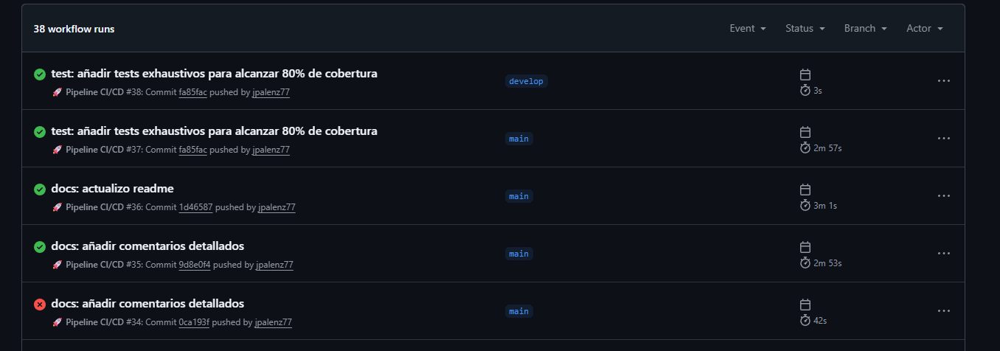
*Dashboard de GitHub Actions mostrando todos los workflows ejecutados exitosamente*

#### Job: Build and Test
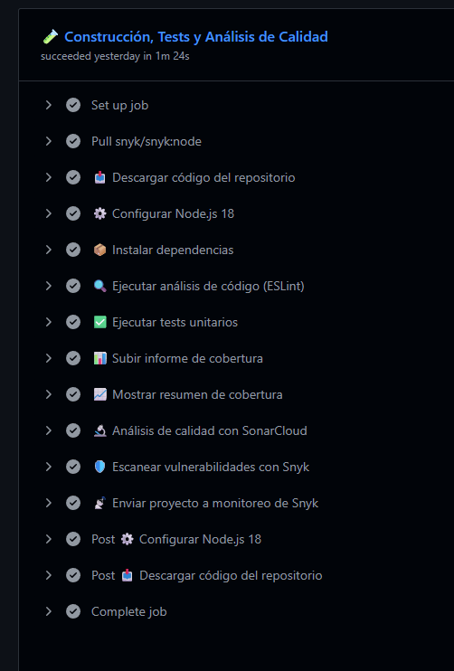
*Detalle del job de construcción, tests, linting, SonarCloud y Snyk*

#### Job: Build Docker
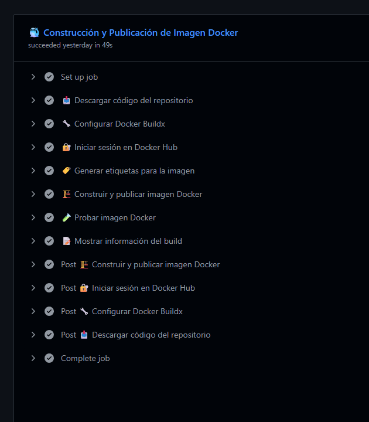
*Construcción y publicación de la imagen Docker en Docker Hub*

#### Artifacts Generados
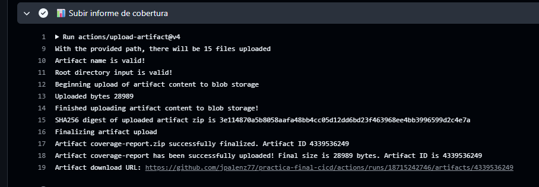
*Artefactos generados incluyendo el informe de cobertura*

---

### 5. Manifiestos de Kubernetes
📁 **Carpeta:** [k8s/](k8s/)
- [namespace.yaml](k8s/namespace.yaml) - Namespace de la aplicación
- [deployment.yaml](k8s/deployment.yaml) - Deployment con 2 réplicas
- [service.yaml](k8s/service.yaml) - Service tipo NodePort
- [kustomization.yaml](k8s/kustomization.yaml) - Configuración de Kustomize

---

### 6. Aplicación Desplegada

**Endpoints disponibles:**
- Health Check: http://localhost:30080/health
- API Info: http://localhost:30080/
- Usuarios: http://localhost:30080/api/users

#### Health Check
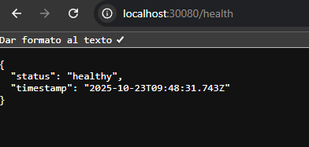
*Respuesta del endpoint de health check mostrando el estado de la aplicación*

#### API Endpoints
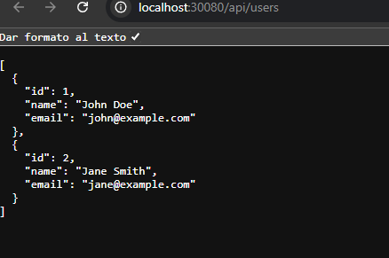
*Endpoint de usuarios devolviendo la lista en formato JSON*

#### Recursos en Kubernetes
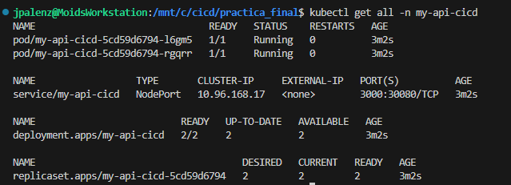
*Pods, services y deployments corriendo en el namespace my-api-cicd*

---

### 7. Proyecto en ArgoCD

**Acceso:** https://localhost:30000  
**Usuario:** admin

#### Dashboard Principal

*Dashboard de ArgoCD mostrando la aplicación en estado Synced y Healthy*

#### Diagrama de Recursos
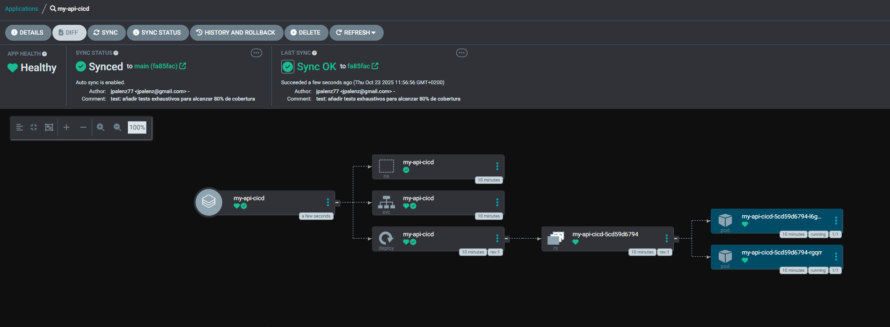
*Vista del diagrama con todos los recursos de Kubernetes gestionados por ArgoCD*

#### Configuración de la Aplicación
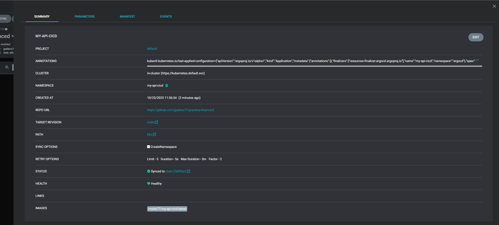
*Detalles de la configuración: source repository, path y destination*

#### Política de Sincronización
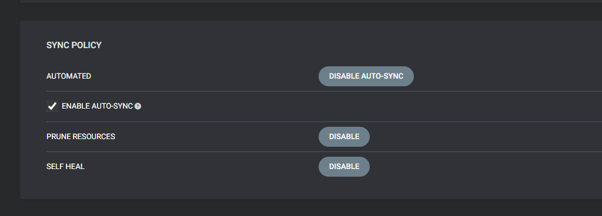
*Política de sincronización automática con prune y self-heal activados*

---

### 8. Proyecto en SonarCloud

🔗 **Enlace:** https://sonarcloud.io/project/overview?id=jpalenz77_practica-final-cicd

#### Dashboard Principal
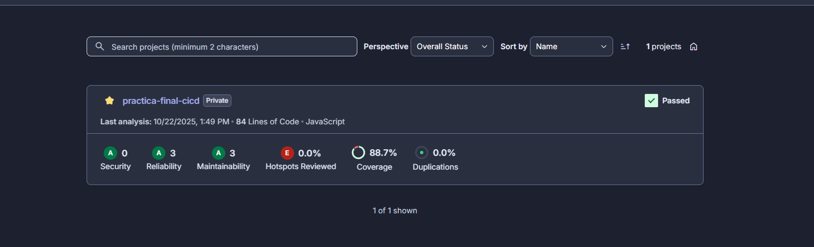
*Métricas principales: Quality Gate, Coverage, Bugs, Vulnerabilities y Code Smells*

#### Cobertura de Código
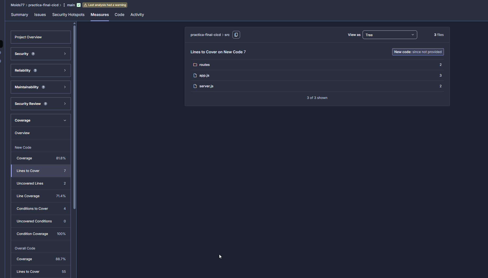
*Desglose de la cobertura de tests por archivo*

#### Quality Gate Status
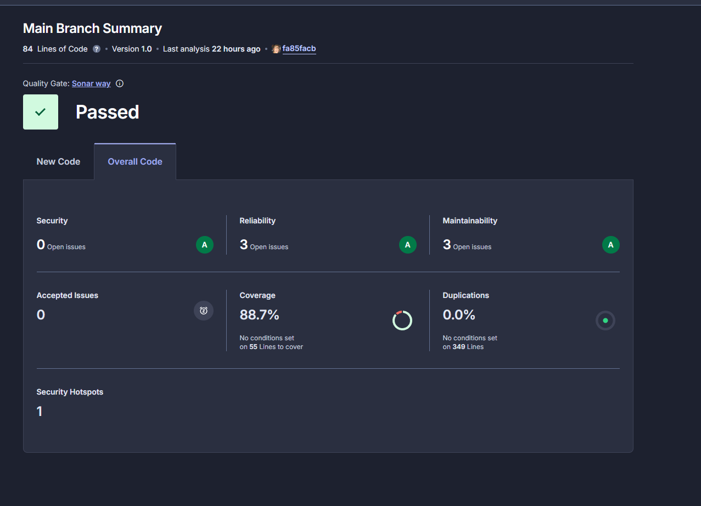
*Estado del Quality Gate mostrando todas las condiciones aprobadas*

---

### 9. Proyecto en Snyk

🔗 **Enlace:** https://app.snyk.io

#### Dashboard de Vulnerabilidades
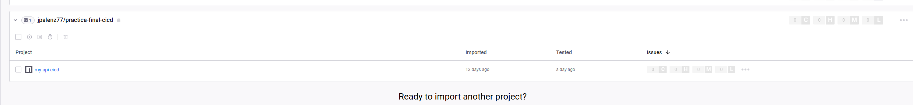
*Análisis de vulnerabilidades en las dependencias del proyecto*

---

### 10. Video Explicativo
🎥 **YouTube:** [Enlace al video - Próximamente]

**Contenido del video:**
- Introducción al proyecto
- Demostración del código fuente
- Pipeline CI/CD en acción
- Análisis de calidad (SonarCloud + Snyk)
- Despliegue con Kubernetes y ArgoCD
- Demo del flujo GitOps completo

---